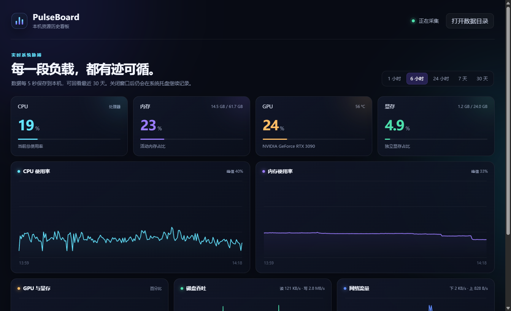

<div align="center">
  

  # PulseBoard

  **每一段负载，都有迹可循。**

  一款为 Windows 开发者打造的中文资源监控看板。<br>
  实时查看 CPU、内存、GPU、显存、磁盘与网络，并在本机保留最近 30 天的完整历史。

  [](https://github.com/piercemacleod0-hub/PulseBoard/releases/latest)
  [](#系统要求)
  [](LICENSE)
  [](#隐私与数据)

  <br>

  [**下载安装版**](https://github.com/piercemacleod0-hub/PulseBoard/releases/latest) · [**下载便携版**](https://github.com/piercemacleod0-hub/PulseBoard/releases/latest) · [反馈问题](https://github.com/piercemacleod0-hub/PulseBoard/issues)
</div>

---



## 为什么做 PulseBoard？

跑代码、训练模型或长时间编译时，实时数字只能告诉你“现在发生了什么”。PulseBoard 会持续保存采样记录，因此任务结束后仍可以回看：什么时候负载升高、显存是否触顶、网络或磁盘何时成为瓶颈。

它不需要 Grafana、Prometheus、浏览器或云端账号。打开一个程序，就能开始记录。

## 功能一览

| 能力 | 说明 |
| --- | --- |
| 📊 实时资源看板 | CPU、内存、GPU、显存、磁盘读写和网络流量每 5 秒刷新 |
| 🕒 长期历史曲线 | 支持回看最近 1 小时、6 小时、24 小时、7 天和 30 天 |
| 🎮 NVIDIA GPU 监控 | 显示 GPU 使用率、温度、显存用量和显卡型号 |
| 💾 自动本地保存 | 按天写入轻量 JSONL 文件，超过 30 天自动清理 |
| 🖥️ 系统托盘常驻 | 关闭主窗口后继续记录，双击托盘图标可重新打开 |
| 🔒 隐私优先 | 不上传数据、不需要账号，也不运行远程服务 |

## 下载安装

前往 [**Releases 下载页**](https://github.com/piercemacleod0-hub/PulseBoard/releases/latest)，根据需要选择：

- `PulseBoard-Setup-*.exe`：安装版，提供桌面和开始菜单快捷方式。
- `PulseBoard-Portable-*.exe`：便携版，无需安装，双击即可运行。

> [!NOTE]
> 项目目前没有商业代码签名证书。Windows 首次运行时可能出现 SmartScreen 提示，可选择“更多信息”→“仍要运行”。

## 使用方法

1. 启动 PulseBoard，程序会立即开始采集并保存数据。
2. 使用右上角的时间按钮切换 `1 小时`、`6 小时`、`24 小时`、`7 天` 或 `30 天`。
3. 关闭窗口时，PulseBoard 会缩到系统托盘并继续记录；在托盘菜单中选择“退出”才会完全停止。

## 隐私与数据

所有历史记录只保存在当前电脑：

```text
%APPDATA%\pulseboard\history
```

每个自然日对应一个 `.jsonl` 文件。你可以在软件右上角点击“打开数据目录”直接查看或备份。PulseBoard 不包含遥测，也不会把硬件信息发送到网络。

## 系统要求

- Windows 10 或 Windows 11（64 位）
- NVIDIA 显卡可获得完整的 GPU、显存和温度数据
- AMD / Intel 显卡可以运行，但部分驱动可能只提供基础信息

## 本地开发

需要 Node.js 20 或更高版本。

```powershell
git clone https://github.com/piercemacleod0-hub/PulseBoard.git
cd PulseBoard
npm install
npm start
```

生成 Windows 安装版和便携版：

```powershell
npm run dist
```

## 技术组成

- Electron：桌面窗口与系统托盘
- systeminformation：跨平台硬件信息采集
- Canvas：轻量历史曲线，无额外图表框架
- JSONL：本地、透明、易备份的历史存储

## 参与项目

欢迎提交 [Issue](https://github.com/piercemacleod0-hub/PulseBoard/issues) 或 Pull Request。提出问题时，建议附上 Windows 版本、显卡型号和问题截图。

---

<div align="center">
  PulseBoard 采用 <a href="LICENSE">MIT License</a> 开源。
</div>
